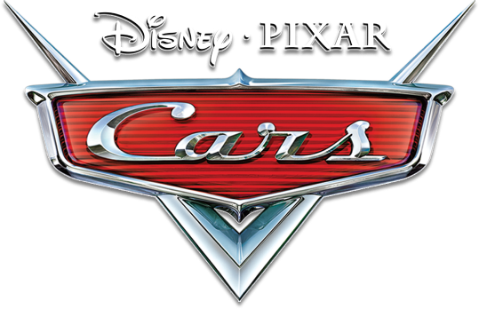

<p align="center">
  
</p>

# Cars Trilogy Wii Patch: Classic Controller & GameCube Controller Suite

A complete patch suite and modern native controller enhancement for the **Disney-Pixar Cars trilogy** on the Nintendo Wii:
1. **Disney-Pixar Cars** (2006)
2. **Disney-Pixar Cars: Mater-National Championship** (2007)
3. **Disney-Pixar Cars Race-O-Rama** (2009)

Providing full analog **Classic Controller** support, native standalone **GameCube Controller** support (no Wii Remote needed), automated Piston Cup pitstop QTE handling, and true widescreen 16:9 FOV correction (hor+).

---

## Features

- **Classic Controller & Classic Controller Pro**:
  - Full analog steering and acceleration.
  - Reinstated native **Camera Toggle** button (Classic Y / GameCube Y) across all three views (Default, Chase, and First-Person bumper cam).
  - Power slide on R trigger, tilt vehicle on L trigger, and boost / nitro on ZR.
  - Motion shake actions (such as Jump) mapped cleanly to **ZL** / **C-Stick**.
- **GameCube Controller (Standalone)**:
  - Plug and play directly into GameCube ports 1–4.
  - Functions completely standalone without requiring any synced Wii Remote.
  - Real hardware support on original Wii consoles as well as Dolphin Emulator.
- **Cars 1: Skip Pitstop Motions**:
  - Automatically satisfies the motion-controlled pitstop tune-up QTE minigames in Piston Cup races, allowing 100% completion with traditional controllers.
- **Cars 1: Fix Widescreen FOV (hor+)**:
  - Fixes the original Wii port's vertical crop (`vert-`), expanding the horizontal field of view (`hor+`) so widescreen displays reveal more track instead of less.
- **Distribution Flexibility**:
  - Standalone desktop patcher GUI with drag-and-drop support.
  - DOL injector CLI.
  - Riivolution XML patches for on-the-fly SD card loading.
  - Dolphin INI & Gecko code text files for all releases.

---

## Supported Releases

| Game | Disc ID | Region | Classic Controller | GameCube Controller | Pitstop Skip | FOV Fix |
| :--- | :--- | :--- | :---: | :---: | :---: | :---: |
| **Cars** (2006) | `RCAE78` | USA | Yes | Yes | Yes | Yes |
| **Cars** (2006) | `RCAP78` | Europe (UK, Australia) | Yes | Yes | Yes | Yes |
| **Cars** (2006) | `RCAX78` | Europe (De, It) | Yes | Yes | Yes | Yes |
| **Cars** (2006) | `RCAY78` | Europe (Fr, Nl) | Yes | Yes | Yes | Yes |
| **Cars** (2006) | `RCAJ78` | Japan | Yes | Yes | Yes | Yes |
| **Mater-National** (2007) | `RC2E78` | USA | Yes | Yes | N/A | N/A |
| **Mater-National** (2007) | `RC2P78` | Europe (UK, Australia) | Yes | Yes | N/A | N/A |
| **Mater-National** (2007) | `RC2X78` | Europe (De, It) | Yes | Yes | N/A | N/A |
| **Mater-National** (2007) | `RC2Y78` | Europe (Fr, Nl) | Yes | Yes | N/A | N/A |
| **Race-O-Rama** (2009) | `R6OE78` | USA | Yes | Yes | N/A | N/A |
| **Race-O-Rama** (2009) | `R6OP78` | Europe (UK, Australia) | Yes | Yes | N/A | N/A |
| **Race-O-Rama** (2009) | `R6OX78` | Europe (Fr, De, It, Es) | Yes | Yes | N/A | N/A |

---

## Controls Reference

### Cars & Cars: Mater-National Championship
| Action | Classic Controller | GameCube Controller |
| :--- | :--- | :--- |
| **Steer** | Left Analog Stick | Control Stick |
| **Accelerate** | A | A |
| **Brake / Reverse** | B | B |
| **Powerslide** | R | R |
| **Tilt Vehicle** | L | L |
| **E-Brake** | X | X |
| **Camera View Toggle** | Y | Y |
| **Nitro Boost / Confirm Event** | ZR | Z |
| **Jump** | ZL / D-Pad Up | C-Stick (any direction) / D-Pad Up |
| **Overworld Map** | Minus (-) | D-Pad Down |
| **Pause Menu** | Plus (+) | Start |

### Cars Race-O-Rama
| Action | Classic Controller | GameCube Controller |
| :--- | :--- | :--- |
| **Steer** | Left Analog Stick | Control Stick |
| **Accelerate** | A | A |
| **Brake / Reverse** | B | B |
| **Drift / Powerslide** | R / ZR | R |
| **Tilt Vehicle** | L / ZL | L |
| **Nitro Boost** | B (in reverse) / Trigger | Z |
| **Jump** | ZL / D-Pad Up | C-Stick / D-Pad Up |
| **Pause** | Plus (+) | Start |

---

## Usage

### 1. Graphical Disc & DOL Patcher
Launch the GUI patcher:
```bash
python3 tools/gui.py
```
1. Select your Cars disc image (`.wbfs` / `.iso`) or extracted `main.dol`.
2. Choose your preferred patch options.
3. Click **Apply Patches**. The tool automatically creates a `.bak` backup of your original disc image before patching in place.

### 2. Command Line Patcher
Patch a raw `main.dol` directly:
```bash
python3 tools/patcher.py input/main.dol output/main.dol --cc --gc --pitstop --fov
```

### 3. Dolphin Emulator
Copy the corresponding `.ini` file from `codes/<DISC_ID>.ini` into your Dolphin `User/GameSettings/` directory.

### 4. Riivolution
Copy the `riivolution/` directory to the root of your SD card or USB drive.

---

## Technical Details

For an in-depth breakdown of assembly trampolines, KPADRead sample synthesis, memory cave layouts, and widescreen FOV calculations, see [docs/TECHNICAL.md](docs/TECHNICAL.md).

---

## Credits

- **Vague Rant**: Original Classic Controller Gecko codes, pitstop skips, and widescreen FOV patches.
- **quatric**: Patch suite architecture, GameCube controller hardware injection, DOL static injector, Riivolution definitions, and desktop UI patcher.

### Modded images

Disc patchers match the first four characters of the game ID (ID4), so mods can change the last two characters. The original disc ID and filename are preserved. Revision and executable patch-site checks still apply; mods that change required code may be incompatible.
